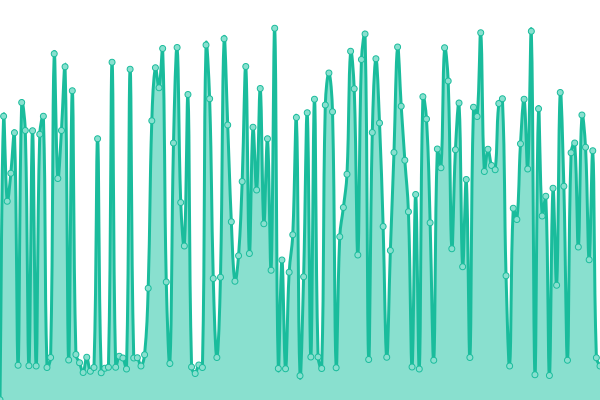
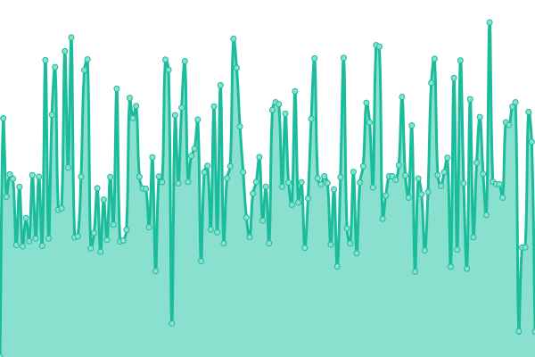
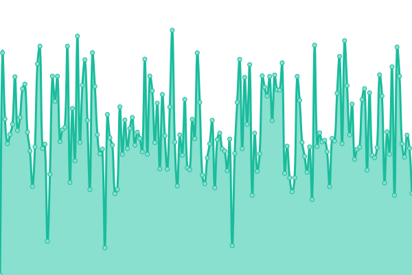

# [📈 Live Status](https://luispenarrubia.github.io/upptime): <!--live status--> **🟩 All systems operational**

This repository contains the open-source uptime monitor and status page for [Luis Peñarrubia](https://luispenarrubia.github.io/upptime), powered by [Upptime](https://github.com/upptime/upptime).

With [Upptime](https://upptime.js.org), you can get your own unlimited and free uptime monitor and status page, powered entirely by a GitHub repository. We use [Issues](https://github.com/luispenarrubia/upptime/issues) as incident reports, [Actions](https://github.com/luispenarrubia/upptime/actions) as uptime monitors, and [Pages](https://luispenarrubia.github.io/upptime) for the status page.

<!--start: status pages-->
<!-- This summary is generated by Upptime (https://github.com/upptime/upptime) -->
<!-- Do not edit this manually, your changes will be overwritten -->
<!-- prettier-ignore -->
| URL | Status | History | Response Time | Uptime |
| --- | ------ | ------- | ------------- | ------ |
|  [API Platform](https://api.six-group.com/healthcheck) | 🟩 Up | [api-platform.yml](https://github.com/luispenarrubia/upptime/commits/HEAD/history/api-platform.yml) | 

 760ms
     
 | 

<a href="https://luispenarrubia.github.io/upptime/history/api-platform">99.54%</a>
    

|  [SOAP Platform](https://soap.six-group.com/healthcheck) | 🟩 Up | [soap-platform.yml](https://github.com/luispenarrubia/upptime/commits/HEAD/history/soap-platform.yml) | 

 808ms
     
 | 

<a href="https://luispenarrubia.github.io/upptime/history/soap-platform">99.54%</a>
    

|  [API Platform (ETU)](https://api-etu.six-group.com/healthcheck) | 🟩 Up | [api-platform-etu.yml](https://github.com/luispenarrubia/upptime/commits/HEAD/history/api-platform-etu.yml) | 

 733ms
     
 | 

<a href="https://luispenarrubia.github.io/upptime/history/api-platform-etu">100.00%</a>
    

|  [SOAP Platform (ETU)](https://soap-etu.six-group.com/healthcheck) | 🟩 Up | [soap-platform-etu.yml](https://github.com/luispenarrubia/upptime/commits/HEAD/history/soap-platform-etu.yml) | 

 720ms
     
 | 

<a href="https://luispenarrubia.github.io/upptime/history/soap-platform-etu">100.00%</a>
    

<!--end: status pages-->

[**Visit our status website →**](https://luispenarrubia.github.io/upptime)

## 📄 License

- Powered by: [Upptime](https://github.com/upptime/upptime)
- Code: [MIT](./LICENSE) © [Luis Peñarrubia](https://luispenarrubia.github.io/upptime)
- Data in the `./history` directory: [Open Database License](https://opendatacommons.org/licenses/odbl/1-0/)
